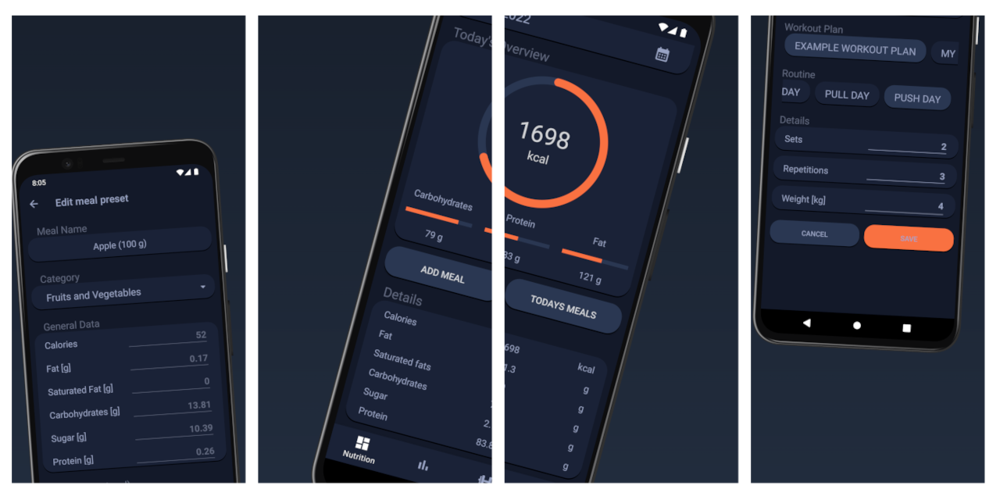

    <!-- Java -->
    
    <!-- Android -->
    

# Gymtonic-App

An Android fitness app for nutrition tracking and workout plans

> Attention: This app is currently in alpha-development-status. At the moment only local storage of data is supported. I am working on a web-backend using Flask and MongoDB which is expected to release soon.

# Features

### Nutrient Tracker
- Track your daily meals and nutrition.
- Get a detailed overview about your daily intake of macro-nutrients, vitamins, trace elements, etc.
- Choose from many existing meal-presets in the database or create your own meal-presets.

### Workout Plans
- Save your own custom workout plan with exercises.
- Organise exercises within multiple plans and routines.

### Body Stats *(coming soon)*
- Track your body stats (like weight) over a period of time.

# Translations

 The language will change depending on the users system settings. The app is currently translated to:
 - English (default)
 - German

# Screenshots

<!-- Icons -->

    

        
        
    

    

    <i>App Icons</i>
    

